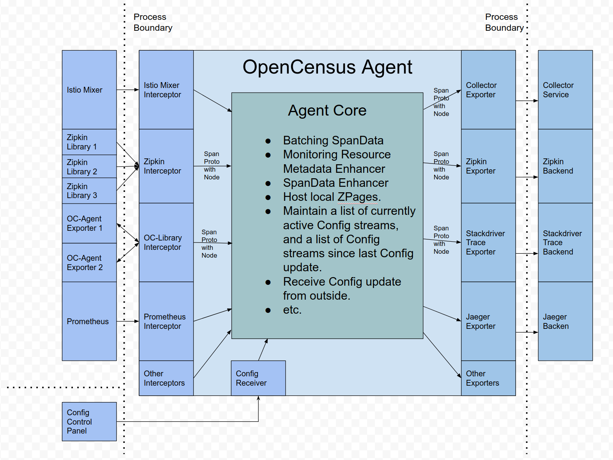

# OpenCensus Agent Proto

This package describes the OpenCensus Agent protocol.

## Architecture Overview

TODO(songya): move this section to the README under agent/service repo.

On a typical VM/container, there are user applications running in some processes/pods with
OpenCensus Library (Library). Previously, Library did all the recording, collecting, sampling and
aggregation on spans/stats/metrics, and exported them to other persistent storage backends via the
Library exporters, or displayed them on local zpages. This pattern has several drawbacks, for
example:

1. For each OpenCensus Library, exporters/zpages need to be re-implemented in native languages.
2. In some programming languages (e.g Ruby, PHP), it is difficult to do the stats aggregation in
process.
3. To enable exporting OpenCensus spans/stats/metrics, application users need to manually add
library exporters and redeploy their binaries. This is especially difficult when there’s already
an incident and users want to use OpenCensus to investigate what’s going on right away.
4. Application users need to take the responsibility in configuring and initializing exporters.
This is error-prone (e.g they may not set up the correct credentials\monitored resources), and
users may be reluctant to “pollute” their code with OpenCensus.

To resolve the issues above, we are introducing OpenCensus Agent (Agent). Agent runs as a daemon
in the VM/container and can be deployed independent of Library. Once Agent is deployed and
running, it should be able to retrieve spans/stats/metrics from Library, export them to other
backends. We MAY also give Agent the ability to push configurations (e.g sampling probability) to
Library. For those languages that cannot do stats aggregation in process, they should also be
able to send raw measurements and have Agent do the aggregation.

For developers/maintainers of other libraries: Agent can also be extended to accept spans/stats/metrics from
other tracing/monitoring libraries, such as Zipkin, Prometheus, etc. This is done by adding specific
interceptors. See [Interceptors](#interceptors) for details.

To support Agent, Library should have “agent exporters”, similar to the existing exporters to
other backends. There should be 3 separate agent exporters for tracing/stats/metrics
respectively. Agent exporters will be responsible for sending spans/stats/metrics and (possibly)
receiving configuration updates from Agent.

## Communication

Communication between Library and Agent should user a bi-directional gRPC stream. Library should
initiate the connection, since there’s only one dedicated port for Agent, while there could be
multiple processes with Library running.
By default, Agent is available on port 55678.

## Protocol Workflow

1. Library will try to directly establish connections for Config and Export streams.
2. As the first message in each stream, Library must sent its identifier. Each identifier should
uniquely identify Library within the VM/container. Identifier is no longer needed once the streams
are established.
3. If streams were disconnected and retries failed, the Library identifier would be considered
expired on Agent side. Library needs to start a new connection with a unique identifier
(MAY be different than the previous one).

## Implementation details of Agent Server

This section describes the in-process implementation details of OC-Agent.

Note: Red arrows represent RPCs or HTTP requests. Black arrows represent local method
invocations.

The Agent consists of three main parts:

1. The interceptors of different instrumentation libraries, such as OpenCensus, Zipkin,
Istio Mixer, Prometheus client, etc. Interceptors act as the “frontend” or “gateway” of
Agent. In addition, there MAY be one special receiver for receiving configuration updates
from outside.
2. The core Agent module. It acts as the “brain” or “dispatcher” of Agent.
3. The exporters to different monitoring backends or collector services, such as
Omnition Collector, Stackdriver Trace, Jaeger, Zipkin, etc.

### Interceptors

Each interceptor can be connected with multiple instrumentation libraries. The
communication protocol between interceptors and libraries is the one we described in the
proto files (for example trace_service.proto). When a library opens the connection with the
corresponding interceptor, the first message it sends must have the `Node` identifier. The
interceptor will then cache the `Node` for each library, and `Node` is not required for
the subsequent messages from libraries.

### Agent Core

Most functionalities of Agent are in Agent Core. Agent Core's responsibilies include:

1. Accept `SpanProto` from each interceptor. Note that the `SpanProto`s that are sent to
Agent Core must have `Node` associated, so that Agent Core can differentiate and group
`SpanProto`s by each `Node`.
2. Store and batch `SpanProto`s.
3. Augment the `SpanProto` or `Node` sent from the interceptor.
For example, in a Kubernetes container, Agent Core can detect the namespace, pod id
and container name and then add them to its record of Node from interceptor
4. For some configured period of time, Agent Core will push `SpanProto`s (grouped by
`Node`s) to Exporters.
5. Display the currently stored `SpanProto`s on local zPages.
6. MAY accept the updated configuration from Config Receiver, and apply it to all the
config service clients.
7. MAY track the status of all the connections of Config streams. Depending on the
language and implementation of the Config service protocol, Agent Core MAY either
store a list of active Config streams (e.g gRPC-Java), or a list of last active time for
streams that cannot be kept alive all the time (e.g gRPC-Python).

### Exporters

Once in a while, Agent Core will push `SpanProto` with `Node` to each exporter. After
receiving them, each exporter will translate `SpanProto` to the format supported by the
backend (e.g Jaeger Thrift Span), and then push them to corresponding backend or service.

## Packages

1. `common` package contains the common messages shared between different services, such as
`Node`, `Service` and `Library` identifiers.
2. `trace` package contains the Trace Service protos.
3. (Coming soon) `stats` package contains the Stats Service protos.
4. (Coming soon) `metrics` package contains the Metrics Service protos.
